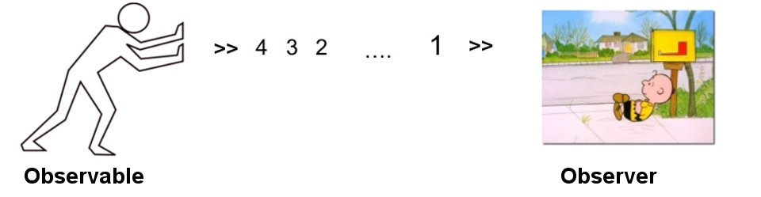

<style type="text/css">
.dark q {
  color: white;
}

g {
  color: green;
}

r {
  color: red;
}

gg {
  font-size: 28pt;
}


strong {
  font-weight: bold;
}

code {
  background-color: #000000;
}
img[alt=marble] {  margin-left: auto;margin-right: auto;width: 800px; }
</style>

## About Me .

Sam Lee (misgod.tw@gmail.com)
<br/>

<ul class="build fade">
 <li>A software engineer lives in Tainan</li>
 <li>Work for htc</li>
 <li>Most used Clojure, Scala and Java</li>
 <li>Interested in Functional Programming</li>
 <li>Interested in Machine Learning and Data Analyst </li>
</ul>

---
## What Is Functional Reactive Programming

A style of programming based on two key ideas: continuous time-varying behaviors, and event-based reactivity


[Try it](excel.xls)

```java
aObservable.map(x -> x*x) //Square
           .reduce((a, b) -> a+b) //Sum
           .subscribe(x -> println(x)); //Show

```

---
## Why Functional Reactive Programming

* Writing concurrent programs correct is difficult.

* You can transforme & compose  asynchronous operations.
    
* High-level abstractions    

* Standard error handling

---
## Say Hello to Rx family
* Java:       **<r>RxJava</r>**
* Scala:      RxScala
* Clojure:    RxClojure
* Groovy:     RxGroovy
* JRuby:      RxJRuby
* JavaScript: RxJS
* C#:         Rx.NET
* C#(Unity):  UniRx
* C++:        RxCpp
* Ruby:       Rx.rb
* Python:     RxPY
* Kotlin:     RxKotlin
    
[http://reactivex.io/]

---
## Introduce to RxJava

* RxJava is a JVM implementation of Reactive Extensions
* RxJava extends Observer pattern to support data/event and compose operators in abstract.
* Built by Netflix
* Support Java 6+ & Android 2.3+
* Java 8 lambda support

---
## Iterable / Observable
<br/>


|             | single items        |multiple items         |
|-------------|---------------------|---------------------- |
|synchronous  |T getData()          |Iterable\<T> getData() |
|asynchronous |Future\<T> getData() |<r>**Observable**\<T></r> getData()|

---
## Asynchronous/Push & Synchronous/Pull  

|event         |Iterable (pull) |Observable (push)
|--------------|----------------|-------------------
|retrieve data |T next() 	      |onNext(T)
|discover error|throws Exception|onError(Exception)
|complete 	   |!hasNext() 	    |onCompleted()


---
## Observable & Observer  



```
pushman.subscribe(new Action1<Integer>() {
  @Override
  public void call(Integer x) {
    println("receive: " + x);
  }
});  
```

--- .segue .dark  
## Lambda Expression

---
## Original
```Java
aObservable.filter(new Func1<Integer, Boolean>() {
               public Boolean call(Integer n) {
                   return n % 2 == 0;
               }
           })
           .map(new Func1<Integer, Integer>() {
               public Integer call(Integer n) {
                   return n * n;
               }
           })
           .subscribe(new Action1<Integer>() {
               public void call(Integer n) {
                   System.out.println(n); 
               }
           });      
```

>> * <gg>WTF...</gg>

---
## Java 8 lambda


```java
aObservable.filter(n -> n % 2 == 0)
           .map(n -> n * n)
           .subscribe(System.out::println);
```

>>* <gg> but ... no java8 on Davilk(Android)</gg>

---
## Retrolambda

### Retrolambda lets you run Java 8 code with **lambda expressions** and **method references** on Java 7 or lower. 
<br/>

* Retrolambda
  - https://github.com/orfjackal/retrolambda

* Gradle plugin
  - https://github.com/evant/gradle-retrolambda

--- .segue .dark  
## rx.Observable 

---
## Creating Observable - create

```java
ob = Observable.create(subscriber -> {
    try {
        for (String s : aList) {
            if (subscriber.isUnsubscribed())
                return;
            subscriber.onNext(s);
        }
        subscriber.onCompleted();
    } catch (Exception e) {
        subscriber.onError(e);
    }
});
```

---
## Creating Observable - create


---
## Creating Observable - from

```java
List<String>  aList = ...;
Observable<String> ob = Observable.from(aList);
```

---
## Creating Observable - just

```java
Observable<List<String>> ob = Observable.just(aList);
Observable<String> ob2 = Observable.just("Some String");
```

---
## Creating Observable - Others...

* repeat( )

* range( )

* interval( )

* timer( )

* empty( )

* error( )

---
## Hot and Cold Observables
<br/>

* <gg> A **“hot”** Observable may begins emitting items as soon as it is created.</gg>

<br/>

* <gg> A **“cold”** Observable waits to emitting items until observer subscribes , and so an observer can see the whole sequenceg.</gg>


---
## Transforming Observables - map


---
## Transforming Observables - map

```java
Observable.range(0, 5)
          .map(x -> toBinaryString(x*x))
          .subscribe(s -> println(s),
                  err ->  err.printStackTrace(),
                  () ->   println("done"));
```
```
0
1
100
1001
10000
done
```

---
## Transforming Observables - flatmap


---
## Transforming Observables - flatmap

```java
Observable.range(1, 3)
          .flatMap(x -> Observable.just(x).repeat(x))
          .subscribe(System.out::println);
```

```
1
2
2
3
3
3
```
>> * <gg> Observable is <r>*Monad*</r> </gg>
     - unit (return) ==> **just**
     - join (bind, >>=) ==> **flatmap**

---
## Transforming Observables - concatmap


---
## Filtering Observables


---
## Filtering Observables
```java
Observable.range(0, 10)
          .filter(x -> (x % 2) == 0)
          .subscribe(System.out::println);
```

```
0
2 
4 
6
8
```

---
## Filtering Observables


* distinct( )
* first( )
* take( )
* skip( )
* elementAt( )
* sample( )
* more...


---
## Aggregate Operators - reduce


---
## Aggregate Operators - reduce
```java
Observable.range(1, 10)
          .reduce((a, b) -> a*b)
          .subscribe(System.out::println);
```
```
3628800
```

---
## Aggregate Operators - concat


---
## Combining Observables - merge


---
## Combining Observables - merge
```java
Observable<String> lower = Observable.from(new String[]{"a", "b", "c"});
Observable<String> upper = Observable.from(new String[]{"A", "B", "C"});

Observable.merge(lower,upper).subscribe(System.out::println);
/* Or */
lower.mergeWith(upper).subscribe(System.out::println);
```

```
a
b
A
c
B
C
```

---
## Combining Observables - startWith


---
## Combining Observables - startWith 

```java
Observable<String> lower = Observable.from(new String[]{"a", "b", "c"});
Observable<String> upper = Observable.from(new String[]{"A", "B", "C"});


lower.startWith(upper).subscribe(System.out::println);
```

```
A
B
C
a
b
c
```

---
## Combining Observables - zip


---
## Combining Observables - zip
```java
Observable<String> lower = Observable.from(new String[]{"a", "b", "c"});
Observable<String> upper = Observable.from(new String[]{"A", "B", "C"});

Observable.zip(lower, upper, Pair::create)
          .map(pair -> pair.first +"_" +pair.second)
          .subscribe(System.out::println);
```

```
a_A
b_B
c_C
```

---
## Error Handling

<br/>

* OnErrorResumeNext

* OnErrorReturn

* retry

<br/>

https://github.com/ReactiveX/RxJava/wiki/Error-Handling-Operators

---
## Threading

### observeOn
specify on which Scheduler a Subscriber should observe the Observable
  
### subscribeOn
specify which Scheduler an Observable should use when its subscription is invoked

<br/>
https://github.com/ReactiveX/RxJava/wiki/Scheduler

---
## Subjects
### A Subject  = Subscriber + Observable

* PublishSubject

* BehaviorSubject

* AsyncSubject

* ReplaySubject

<br/>

https://github.com/ReactiveX/RxJava/wiki/Subject

---
## Subjects - How to use

Subscriber -----> Observable

```java
PublishSubject<Integer> subject = PublishSubject.create();

//Observable
subject.map(x -> x*x)
       .subscribe(o -> println(o));
       
subject.map(x -> x+1)
       .subscribe(o -> println(o));       
```

```
//Subscriber
subject.onNext(11);
subject.onNext(11);
subject.onCompleted();
```

* Masking a Subject as an Observable - <b>aSubject.asObservable()</b>

--- .segue  .dark
## RxJava on Android 

---
## About Android Development

* Developing a robust app is painful
  - life cycle, async, event, state, threading, error handling
  
* Developing a good UX app is painful
  - interactive, realtime, smooth, animation

* Thread, Executor, Handler, AsyncTask, Loader ...

* RxJava can mitigate your pain

* Retrofit supports methods with a return type of rx.Observable

```java
  @GET("/user/{id}/photo")
  Observable<Photo> getUserPhoto(@Path("id") int id);
```

---
## RxAndroid

* RxJava bindings for Android

* Scheduler  on  main UI thread or a given Android Handler thread.
  - AndroidSchedulers
  - HandlerThreadScheduler
  
* Reactive components for common Android use cases and UI widgets
  - AndroidObservable
  - ViewObservable


### Don't forget to unsubscribe to avoid memory leak!

--- .segue  .dark
## Let's Thinking in Functional Reactive

---
## Case 1 - Say Hello to Callback Hell

```java
/* API */
void getFromServer(String key, Action1<String> callback);
void getFromDB(String key, Action1<String> callback);

/* Code */
btnClick.setOnClickListener(new View.OnClickListener() {
    public void onClick(View view) {
        getFromDB("myid", new Action1<String>() {
            public void call(String s) {
                getFromServer(s, new Action1<String>() {
                    public void call(final String s) {
                     runOnUiThread(new Runnable() {
                            public void run() {
                                Toast.makeText(context, s, LENGTH_LONG).show();
                            }
                        });
     /* ... a lot of }) ... */

```

---
## Case 1 - Say Hello to Callback Hell

### Using Lambda expression 
```java
btnClick.setOnClickListener(view ->
    getFromDB("myid",
            s -> getFromServer(s,
                        x -> runOnUiThread(
                                () -> Toast.makeText(context, x, LENGTH_LONG).show()))));

```

>> * <gg>Shorter but not easy to read </gg>


---
## Case 1 - Say Goodbye to Callback Hell

### Using rx.Observable
```java
/* API */
Observable<String> getFromServer(String key);
Observable<String> getFromDB(String key);

/* Code */
ViewObservable.clicks(btnClick)
              .map(x -> "myid")
              .observeOn(Schedulers.io())
              .flatMap(this::getFromDB)
              .flatMap(this::getFromServer)
              .observeOn(AndroidSchedulers.mainThread())
              .subscribe(x -> Toast.makeText(context, x, LENGTH_LONG).show());  
```

---
## Case 2 - All In One search
#### Requirements
1. A search engine includes google/yahoo/bing search results.
2. Should search different engines in parallel
3. Retry 3 times when search fail
4. remove redundant url

```java
Observable<SearchResult> g = googleSearch.search(keyword).retry(3);
Observable<SearchResult> b = bingSearch.search(keyword).retry(3);
Observable<SearchResult> y = yahooSearch.search(keyword).retry(3);

Observable.merge(g, b, y)
          .distinct(site -> site.url)
          .observeOn(AndroidSchedulers.mainThread())
          .subscribe(site -> appendDataForUI()                          ,
                     err -> errorhandle(err));
```

---
## Case 3 - A simple EventBus

```java
PublishSubject<Object> subject = PublishSubject.create(); //Global Singleton
```
```java
//...In Class A...
subject.filter(x ->  x instanceof DataUpdateAction)
       .subscribe( x -> ... doSomething ...);

//...In Class B...
subject.filter(x ->  x instanceof DeleteAction)
       .subscribe( x -> ... doSomething ...);

//...In Class C...
subject.filter(x ->  x instanceof RefreshAction)
       .subscribe( x -> ... doSomething ...);
```
```java
subject.onNext(aDataUpdateAction);
subject.onNext(aDataUpdateAction;
subject.onNext(aRefreshAction);
```

---
## Case 4 - Input Suggestion


```java
private Observable<String> getSuggestion(String prefix) { ... }

Observable<Observable<List<String>>> o =
                ViewObservable.text(aEditText)
                              .map(event -> event.text.toString())
                              .filter(x -> x.length() > 1)
                              .observeOn(Schedulers.io())
                              .map(x -> getSuggestion(x).toList());

Observable.switchOnNext(o)
          .observeOn(AndroidSchedulers.mainThread())
          .subscribe(lst -> showSuggestion(lst));
```

---
## Conclusion

1. Functional Reactive makes async/state design straightforward.

2. RxJava is not just a library. It's a framework!

3. The importantest part is Functional Reactive Thinking.

4. Try It in your next project!

--- #qa
<style>
#qa {
  background-image:url(http://www.zillow.com/blog/files/2013/01/Q-A.jpg); 
  background-repeat: no-repeat;
  background-position: center center;
  background-size: cover;
}
</style>